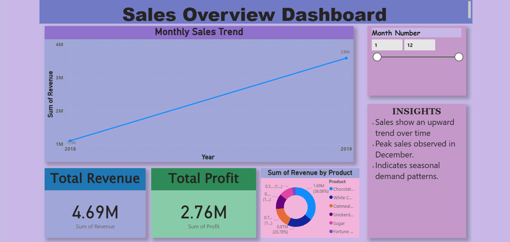
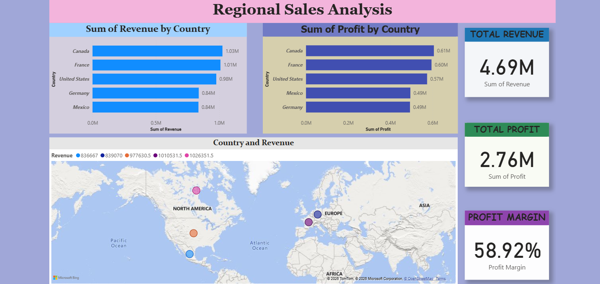
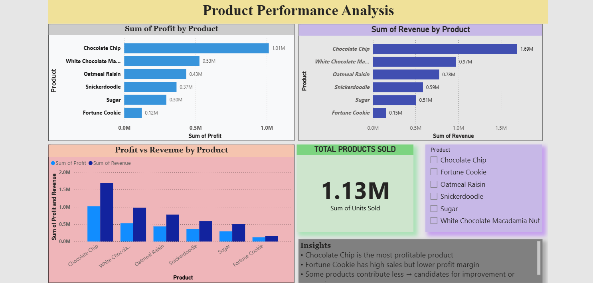
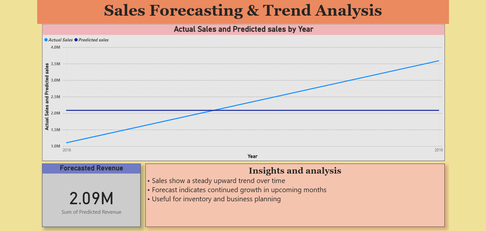

# 📊 Retail Sales Performance Monitoring System

## 🚀 Project Overview

This project analyzes retail sales data and provides actionable insights into sales trends, product performance, and regional analysis. It also includes machine learning models to forecast future sales.

---

## 🛠️ Tech Stack

* Python (Pandas, NumPy, Scikit-learn)
* Power BI (Dashboard Visualization)
* Excel (Data Source)
* Git & GitHub (Version Control)

---

## 📈 Features

* 📊 Sales Trend Analysis
* 🌍 Regional Sales Analysis
* 🍪 Product Performance Insights
* 🔮 Sales Forecasting using ML models
* 📉 KPI Monitoring Dashboard

---

## 🤖 Machine Learning Models

* Linear Regression
* Random Forest (Advanced Model)

---

## 📊 Dashboard Pages

1. Sales Overview
2. Regional Analysis
3. Product Performance
4. Forecasting

---

## 📁 Project Structure

```
📂 Project
 ├── Data_manipulation.py
 ├── monthly_sales.csv
 ├── country_sales.csv
 ├── product_sales.csv
 ├── forecast_sales.csv
 ├── README.md
 └── Documentation.docx
```

---

## 🔮 Future Improvements

* Customer Segmentation (K-Means)
* Real-time data integration
* Advanced forecasting (ARIMA)
* Cloud deployment

---

## 👨‍💻 Author

Jackal

---

⭐ If you like this project, give it a star!

## 📸 Dashboard Preview

### Sales Overview


### Regional Analysis


### Product Performance


### Forecasting

